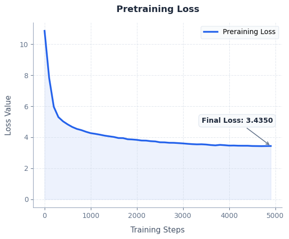

# Paperback-GPT-DPO

A decoder-only GPT-style transformer built entirely from scratch in PyTorch, featuring Rotary Positional Embeddings (RoPE), Flash Attention, mixed-precision training, and a manual implementation of Direct Preference Optimization (DPO).

The model is pretrained on a **25-book Project Gutenberg corpus (~13 million characters)** and then aligned using **self-generated preference pairs**, without relying on external RLHF or DPO libraries.

---

## Architecture

| Component | Value |
|-----------|------:|
| Parameters | **19.2M** |
| Transformer layers | 8 |
| Embedding dimension | 256 |
| Attention heads | 8 |
| Context length | 128 |
| Positional encoding | RoPE |
| Vocabulary size | 50,257 (GPT-2 BPE) |

---

## Training Loss

<p align="center">

</p>

Cross-entropy loss during pretraining on the 25-book corpus.

---
## Base vs. DPO-Tuned Generations

Generations from the same pretrained checkpoint before and after DPO using held-out prompts.

| Prompt | Base (Pretrained) | DPO-Tuned |
|---------|-------------------|------------|
| *Sometimes life really is just...* | *Shot somewhere less broad. I expected him to wish...* | *The same thing in a tolerable place without sending it away...* |
| *I don't see the point in...* | *The business is done. Cross Campbells; therefore...* | *The wooden land, for they supposed...* |
| *The thing about growing up is...* | *Splendid to her. Here I can't try to spare...* | *So delightful that I never became...* |
| *It is a truth universally acknowledged...* | *Mr. Darcy's certainty might be puffing in the discovery...* | *Mr. Collins... it may be, however...* |
| *Curiouser and curiouser said...* | *I don't doubt you, John...* | *That, as you had about this business...* |
| *It was the best of whales...* | *Whale's emergency; whether for the Pequod...* | *Very dead sailor for Fielding...* |
| *Call me Ishmael but honestly...* | *Shaking my face and frame...* | *Remember me much: I want as a family...* |

> Preference pairs were generated automatically from the pretrained model rather than human annotations. These examples provide a qualitative comparison of generations before and after DPO.

---

## Features

### GPT Pretraining

- Decoder-only GPT architecture implemented entirely from scratch in PyTorch
- Rotary Positional Embeddings (RoPE)
- Flash Attention via `torch.nn.functional.scaled_dot_product_attention`
- GPT-2 BPE tokenizer (`tiktoken`)
- Mixed-precision training (`torch.amp`)
- Weight tying between token embeddings and output projection
- Cosine learning-rate decay with warmup
- Gradient clipping
- Google Drive checkpointing for long Colab sessions

### Direct Preference Optimization (DPO)

- Frozen reference model
- Automatic preference pair generation
- Manual implementation of the Bradley-Terry DPO objective
- No Hugging Face TRL or RLHF libraries

---

## Dataset

The model was trained on approximately **13 million characters** from **25 public-domain books**, downloaded directly from **Project Gutenberg**.

Books include:

- Pride and Prejudice
- Emma
- Sense and Sensibility
- Alice's Adventures in Wonderland
- Frankenstein
- Moby-Dick
- Dracula
- Jane Eyre
- Wuthering Heights
- Great Expectations
- A Tale of Two Cities
- Adventures of Huckleberry Finn
- The Adventures of Tom Sawyer
- The Adventures of Sherlock Holmes
- Treasure Island
- Dr. Jekyll and Mr. Hyde
- The Picture of Dorian Gray
- The Wonderful Wizard of Oz
- Grimm's Fairy Tales
- Heart of Darkness
- Metamorphosis
- The Time Machine
- The War of the Worlds
- The Yellow Wallpaper
- The Iliad

The corpus is tokenized using the GPT-2 Byte Pair Encoding (BPE) tokenizer provided by `tiktoken`.

---

## Training

### Pretraining

- 5,000 optimization steps
- AdamW optimizer
- Peak learning rate: **3e-4**
- Minimum learning rate: **3e-5**
- Cosine learning-rate decay with 200 warmup steps
- Mixed precision (FP16)
- Gradient clipping (norm = 2.0)

### Direct Preference Optimization

- Frozen reference model copied from the pretrained checkpoint
- Two completions sampled per prompt
- Higher log-probability completion selected as the preferred response
- DPO trained using β = 0.1
- Batch size = 8

The optimization objective is

```text
loss = -logsigmoid(β[(chosen_logratio) − (rejected_logratio)])
```

where each log-ratio is computed as the difference between the policy model and frozen reference model log-probabilities.

---

## Running the Project

1. Mount Google Drive and specify a checkpoint directory.
2. Download the Project Gutenberg corpus.
3. Tokenize using the GPT-2 BPE tokenizer.
4. Pretrain the GPT model.
5. Freeze a copy as the reference model.
6. Generate preference pairs.
7. Train using the DPO objective.
8. Generate comparison samples.

---

## What I Learned

- Building a decoder-only transformer entirely from scratch.
- Implementing Rotary Positional Embeddings (RoPE).
- Using Flash Attention for efficient causal self-attention.
- Mixed-precision GPT training and modern optimization techniques.
- Implementing Direct Preference Optimization (DPO) without external RLHF libraries.
- Why DPO requires a frozen reference model and preference log-ratios.
- Practical debugging of long-running GPU training in Google Colab, including checkpointing and recovering from memory issues.
- Diagnosing overfitting through train/validation loss rather than relying solely on training loss.

---

## Limitations

The preference pairs used for DPO were generated automatically from the pretrained model rather than collected from human annotators. As a result, the DPO stage primarily demonstrates a correct implementation of the preference optimization pipeline rather than learning human-aligned preferences.

Consequently, improvements in generation quality are modest. Future work would involve training on human preference datasets or instruction-following data to better showcase the benefits of DPO.
---
## Future Work

- Incorporate human-annotated preference datasets for more meaningful alignment.
- Scale the model to larger parameter counts and training corpora.
- Support longer context windows for improved long-range reasoning.
- Explore instruction tuning prior to DPO.
- Evaluate on standard language modeling benchmarks (e.g., HellaSwag, PIQA, ARC).

